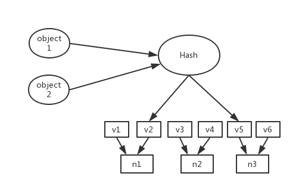

设计目标是为了解决因特网中的热点问题。

判定哈希算法好坏的四个方面：

1. 平衡性。哈希结果尽可能分布到所有缓冲
2. 单调性。增加新的缓冲区，哈希的结果应保证已分配内容被映射到原有缓冲区或新的缓冲区，而不应被映射到其他旧的缓冲区。
3. 分散性。
4. 负载

**单调性说明**

主机根据ip地址和虚拟机的编号 host_ip#id生成hash值，排列成环。 需要缓存的对象也用同样的hash算法生成hash值，排列成环。 然后对象存储在顺时针离它最近的主机上。 单调性体现在:  无论是新增主机还是删除主机，需要改变位置的都是离那台主机最近的数据，其他数据不需要变动。

## 一致性哈希是如何设计的

在采用一致性哈希算法的分布式集群中将新的机器加入，其原理是通过hash算法将机器也映射到环中，然后以顺时针方向将对象存储到离自己最近的机器节点。

步骤如下：

1. 环形hash空间
2. 把数据通过hash算法处理后映射到环上
3. 将机器通过hash算法映射到环上
4. 顺时针就近查找节点


**进行机器添加或删除时，对数据迁移的影响**

如果某个节点出现故障被删除，按照顺时针迁移的方法，将故障节点上的对象迁移到最近的下个节点。只有故障节点上的对象发生变化，其它的对象没有任何改动。

如果向集群中添加一个新节点，通过哈希算法计算机器的哈希值，并映射到环中。将新节点和新节点之前节点之间的数据迁移到新节点，其他对象保持原有的存储位置。

通过对节点添加和删除过程的分析，一致性哈希算法保证了单调性，并使数据迁移量达到最小。这样的算法对分布式集群来说是非常合适的，避免了大量数据迁移，减小了服务器的压力。

**满足平衡性要求**

在一致性哈希算法中，为了尽可能地满足平衡性，引入了虚拟节点。通过引入虚拟节点，对象的分布就更加均衡了。

在实际的操作中，对象hash到的虚拟节点，再进行虚拟节点到实际节点的转换。如下图所示。



## 普通的哈希算法

简单的哈希算法是简单的对服务器数量进行取模，当服务器数量发生变化时，会产生缓存的雪崩（大部分缓存的位置都失效了）。

```c++
hash(o) mod n
hash(o) mod (n+1)  // add node
hash(o) mod (n-1)  // remove node
```

n是所有机器节点的数量。

这种方法有个很大的缺陷，当添加或删除节点时，大部分的数据对象会散落到新的机器上，这就需要进行大量的数据迁移。这也是为何需要引入一致性哈希算法。

## 问题

有没有使用一致性哈希算法的具体例子？

如何解决碰撞问题？

如何解决数据倾斜的问题？

答：当集群的节点数量很少时，会容易产生数据倾斜。这个问题可通过虚拟节点的方式来解决。在虚拟节点和真实机器之间再进行一次映射。